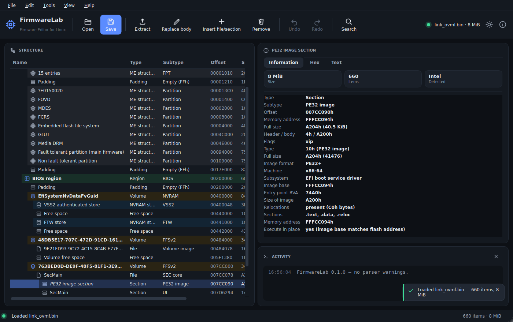

# FirmwareLab

**A modern, feature-rich UEFI/BIOS firmware explorer, editor and modding toolkit.**

FirmwareLab parses, edits and *rebuilds* the firmware images you flash to an SPI
EEPROM. Think of it as a spiritual successor to UEFITool with a bigger feature set:
a graphical editor, a scriptable command line, a read-only BIOS Setup/IFR browser,
NVRAM variable editing, Intel flash-descriptor and ME awareness, microcode and
Boot Guard analysis, image diffing, pattern patching, and flash-preparation helpers.

It is written from scratch in Python (no compiled dependency beyond the standard
library; `PySide6` only for the GUI), runs primarily on **Arch Linux** and works on
any distro with Python ≥ 3.10. Its interface is part of the **EZP2019Linux suite** —
same dark/light theme, cards, icons and hex view — so the two tools feel like one product.



> ⚠️ **Flashing the wrong image can brick your board.** Always keep a backup and,
> where possible, an external SPI programmer. FirmwareLab verifies every rebuild by
> re-parsing it, but you are responsible for what you flash.

---

## Highlights

- **Faithful parse + byte-exact rebuild.** Opening and re-saving an untouched image
  reproduces it bit-for-bit. Verified against real OVMF and assembled Intel images,
  and cross-checked against UEFITool's `UEFIExtract` (identical item tree on OVMF).
- **Real edits that boot.** Editing a driver inside an LZMA-compressed volume, or
  even *moving* the XIP SEC core (with automatic PE relocation and reset-vector
  patching), produces images that boot to the UEFI shell in QEMU with identical
  output to the original.
- **Formats understood:**
  UEFI capsules (UEFI/FMP/AMI Aptio/Toshiba) · Intel flash descriptor (v1/v2,
  regions, masters, straps, VSCC chip table, lock state) · Intel ME/CSME ($FPT and
  IFWI/BPDT partition layout, version) · GbE (MAC + NVM checksum) · firmware
  volumes / FFS files / all section types · PE32/PE32+/TE images (with XIP
  detection) · NVRAM stores (VSS, VSS2, FTW, Insyde FDC, Phoenix EVSA, AMI NVAR) ·
  Intel microcode (with CPUID→codename) · FIT · Boot Guard KM/BPM/ACM and IBB
  ranges · AMD PSP/BIOS directories · PCI option ROMs · ACPI/SMBIOS/logo blob
  identification.
- **Codecs:** EFI 1.1 & Tiano (own implementation, round-trip verified against the
  EDK2 reference), LZMA / Intel-legacy-LZMA / LZMAF86 (with x86 BCJ), Brotli, GZip,
  Zlib, CRC32 GUID-defined sections.
- **Compression-aware.** Search, patch and edit reach *inside* compressed volumes;
  affected sections are transparently recompressed on save.
- **Board & BIOS identification.** Works out the target motherboard make/model and
  BIOS revision by cross-referencing the AMI/Intel `$IBIOSI$` BIOS ID, embedded
  SMBIOS Type 0/1/2 templates and Insyde `$BVDT` data — reaching inside compressed
  volumes — and reports each field with its source and confidence.
- **Non-destructive & undoable.** Copy-on-write edit model with full undo/redo, and
  a verification pass that re-parses the rebuilt image and reports every changed
  file, moved module and new warning before writing.

## Installing

FirmwareLab is used mainly through its **graphical editor**. Pick whichever route
below fits your system — each ends with a `firmwarelab` command and an application-menu
entry that launch the GUI. (`liblzma`/`xz`, usually already installed, gives the best
LZMA encoding; a pure-Python fallback is used if it is missing.)

### Just run it (no install)

The fastest way to try it — needs only Python and PySide6:

```sh
git clone https://github.com/oreo1298/FirmwareLab
cd FirmwareLab
sudo pacman -S --needed python pyside6 python-brotli   # Arch/Manjaro
./firmwarelab.sh                                        # launches the GUI
./firmwarelab.sh bios.bin                               # …opening an image
```

On other distros install PySide6 from your package manager (Debian/Ubuntu:
`sudo apt install python3-pyside6.qtwidgets python3-brotli`; Fedora:
`sudo dnf install python3-pyside6`) and run `./firmwarelab.sh`.

### Arch Linux — system package

Builds a real package (GUI included) from this checkout and installs it with pacman,
along with the `.desktop` entry and icon:

```sh
cd packaging
makepkg -fsi
```

`pyside6` is pulled in as a dependency, so the GUI works out of the box; `flashrom`
and `python-brotli` are optional depends.

### Any distro — user install (no root)

Installs into a self-contained virtualenv under `~/.local` and drops launchers +
a desktop entry on your PATH. It reuses a system PySide6 if one is present (so it
stays small), otherwise it pip-installs PySide6 into the venv:

```sh
./packaging/install.sh          # GUI + CLI  (PREFIX=~/.local by default)
NO_GUI=1 ./packaging/install.sh # CLI only, skip PySide6
make uninstall                  # remove it again
```

### pip / pipx (advanced)

FirmwareLab's core has **no** third-party dependencies, so a CLI-only install is
trivial. On modern distros (Arch included) the system Python is
externally-managed, so use a virtualenv or `pipx` rather than a bare
`pip install` — that is what "the pip command doesn't work" usually means:

```sh
pipx install "firmwarelab[gui] @ ."   # isolated app with the GUI
# or inside a venv you control:
python -m venv .venv && . .venv/bin/activate
pip install ".[full]"                 # fwlab + firmwarelab GUI + brotli
```

Extras: `gui` (PySide6), `brotli` (Brotli sections), `full` (both), `dev` (+pytest).

## Graphical editor (the main interface)

Launch `firmwarelab` (from the app menu or the shell), `./firmwarelab.sh`, or
`fwlab gui`, and open an image — or just drag a `.bin`/`.rom`/`.fd`/`.cap` onto the
window. It opens a three-pane workspace:

- **Structure tree** on the left, color-coded by type, with volumes/regions in bold,
  execute-in-place modules italicised, and protected/inactive items tinted. Names are
  resolved from the GUID database and UI/version sections.
- **Information · Hex · Text** tabs on the right: a full property sheet that leads
  with the detected board make/model and BIOS revision, a fast hex view (showing the
  item at its real flash address), and a text/body view that renders UI strings,
  versions and dependency expressions.
- **Message log** at the bottom listing every parser warning.

Everything you can do on the command line is on the menus:

- **File** — open, save, save-as, reload, and an *Open Recent* list; drag-and-drop.
- **Edit** — extract, replace body/file, insert, remove, rebuild, and full
  **undo/redo**.
- **Tools** — search (text/GUID/hex, reaching into compressed volumes), the NVRAM
  variable editor, the read-only BIOS Setup browser, the IFR/HII viewer, image
  compare, patch-script application, flash-descriptor unlock and a flash-readiness
  report.
- **View** — dark/light theme toggle, expand/collapse.

Opening and saving large images run on a background thread, so the window stays
responsive; a save always rebuilds, re-parses and verifies before writing, and
reports moved/rebased modules and any warnings. Right-click any tree item for its
context actions.

## Command line — `fwlab`

```sh
fwlab info bios.bin --summary          # high-level summary + warnings
fwlab identify bios.bin                 # target board make/model + BIOS revision
fwlab identify bios.bin -v              # …with every source and its confidence
fwlab tree bios.bin --depth 3          # structural tree with offsets/addresses
fwlab info bios.bin --json             # full machine-readable dump

# Explore
fwlab search bios.bin --text "Setup"           # ascii+ucs2, incl. compressed data
fwlab search bios.bin --guid EE4E5898-3914-...  # by GUID
fwlab search bios.bin --hex "554546493c..??"    # wildcards with '..'
fwlab hexdump bios.bin PlatformDxe

# Edit (writes bios_mod.bin by default; --inplace / -o to choose)
fwlab extract bios.bin PlatformDxe -o plat.ffs
fwlab replace bios.bin PlatformDxe newbody.bin      # replace a body/section
fwlab insert  bios.bin <volume> newdriver.ffs       # add an FFS file
fwlab remove  bios.bin LogoDxe
fwlab patch   bios.bin patches.txt                  # pattern/offset patch script

# Analyze / mod hardware structures
fwlab microcode bios.bin
fwlab descriptor bios.bin                 # regions, masters, lock state, chips
fwlab descriptor bios.bin --unlock        # grant host write access (ifdtool-style)
fwlab gbe bios.bin --set-mac 00:11:22:33:44:55
fwlab nvram bios.bin --name Boot          # list NVRAM variables
fwlab nvram bios.bin --set Timeout 0a00   # set a variable's raw value
fwlab setup bios.bin --search "Secure Boot"   # BIOS Setup questions + current values
fwlab ifr bios.bin --module Setup             # dump IFR forms as text

# Compare & flash prep
fwlab diff old.bin new.bin
fwlab flash bios.bin                       # flash-readiness report
fwlab flash cap.cap --strip-capsule -o payload.bin
fwlab flash bios.bin --pad-to 16M
fwlab split full.bin                       # split by descriptor into regions
fwlab assemble --descriptor fd.bin --region ME=me.bin --region BIOS=bios.bin -o full.bin

# Graphical
fwlab gui bios.bin
```

Selectors accept an index path (`0/2/1`), a GUID, or a name substring.

### Patch scripts

UEFIPatch-style, but reaching inside compressed volumes:

```
# <file-GUID>  <section-type|*>  ACTION
# P: pattern replace (equal length, '..' = wildcard/keep original)
# O: absolute offset in the node body
D9DCC5DF-4007-435E-9098-8970935504B2  15  P:50006c00:43004c0049..
1B18524A-...                          10  O:1000:9090
```

## Safety model

Every save runs the builder and then **re-parses the result**, comparing it against
your edited tree. It refuses to write if the rebuilt image gains a checksum error,
an unparsable structure or a volume overflow, and it warns about:

- files that had to move (and were rebased if they execute in place),
- edits that fall inside a **Boot Guard**-protected range (the board may reject them),
- changes to **signed** GUID-defined sections (signature no longer valid),
- overall image size changes.

FirmwareLab never silently disables integrity checks.

## How it compares to UEFITool

FirmwareLab reproduces UEFITool/UEFIExtract's parse of the UEFI/BIOS portion
item-for-item, and adds: a native GUI editor on Linux, a scriptable CLI, NVRAM
variable *editing*, a BIOS Setup/IFR browser mapped to live NVRAM values, XIP-aware
rebuilding with automatic rebasing, image diffing, region assemble/split, flash
descriptor unlock, GbE MAC editing and flash-preparation helpers — in one tool.
Deep CSE ($CPD entry) decomposition of the ME region is summarised rather than fully
expanded (the ME is usually treated as an opaque region for modding).

## Development

```sh
python -m venv .venv && . .venv/bin/activate   # avoid the system-Python restriction
pip install -e ".[dev]"
make test                                       # or: pytest -q
FWLAB_TEST_OVMF=/usr/share/OVMF/OVMF.fd pytest  # include OVMF integration tests
make gui-check                                  # headless GUI smoke test
make run                                         # launch the GUI from source
```

70+ tests cover the codecs, parse/build round-trips, edit operations, tools and HII;
the OVMF-based integration tests auto-skip when no OVMF image is installed.

## License & credits

BSD-2-Clause. See `LICENSE` and `NOTICE`.

The bundled GUID and JEDEC databases and the firmware format layouts are derived
from [UEFITool](https://github.com/LongSoft/UEFITool) by Nikolaj Schlej
(BSD-2-Clause); the EFI/Tiano decompressor follows the TianoCore EDK II reference.
FirmwareLab is an independent implementation and is not affiliated with those
projects.
